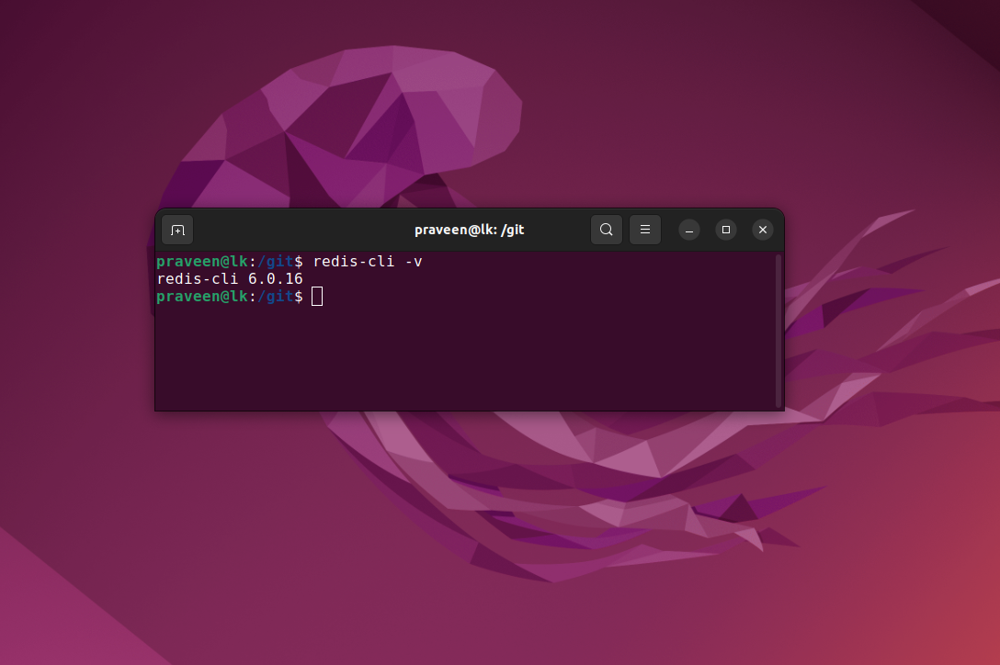
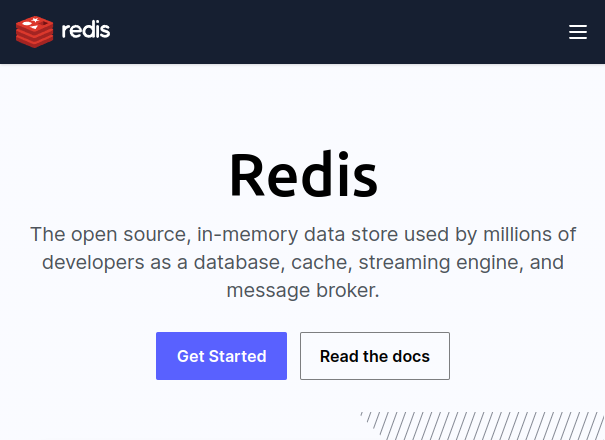
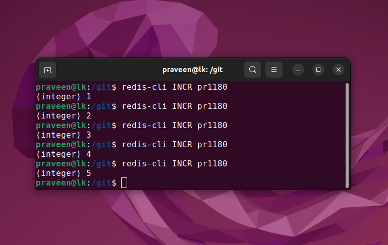
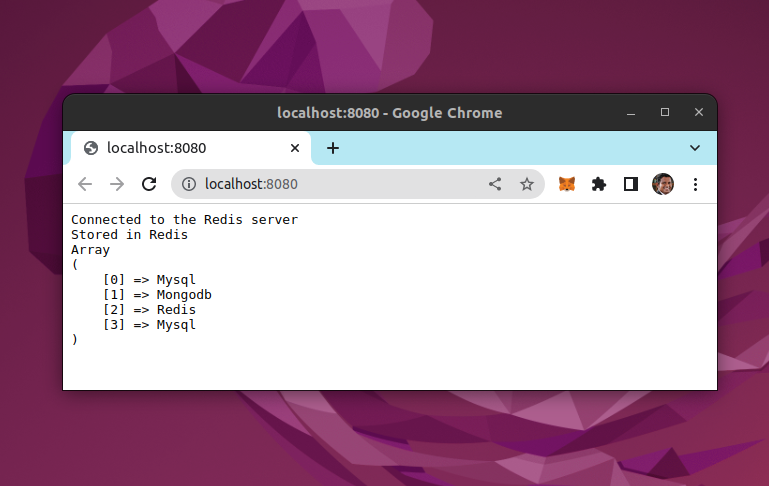

# Redis

## Remote Dictionary Server



## Open Source In Memory Data Store

https://redis.io/



# Developer: Salvatore Sanfilippo

https://github.com/antirez


## Redis CLI



All commands: https://redis.io/docs/manual/cli/

```
sudo apt-get install redis
sudo apt-get install php-redis
```

# PHP Redis

```
$redis = new Redis(); 
$redis->connect('127.0.0.1', 6379); 
echo "Connected to the Redis server<br>"; 

$redis->lpush("dbs", "Redis"); 
$redis->lpush("dbs", "Mongodb"); 
$redis->lpush("dbs", "Mysql");  

$arList = $redis->lrange("dbs", 0 ,3); 

echo "Stored in Redis <br>"; 
print_r($arList); 
```

